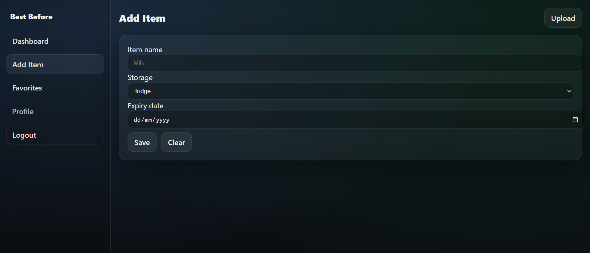
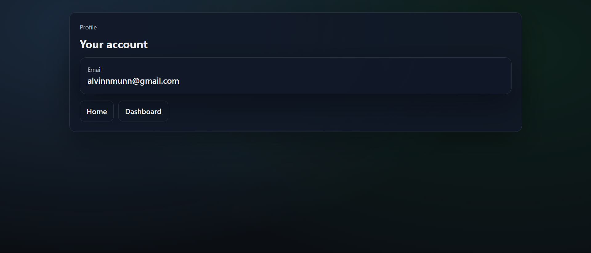

# BestBefore AI

This is a smart food expiry tracking web application that helps users reduce food waste by tracking expiry dates, detecting expiring items, and automatically extracting expiry information from product images using OCR.

---

## Features

- **User Authentication**
  - Register & Login with credentials

- **Dashboard Overview**
  - Total items
  - Safe items
  - Expiring soon
  - Expired items

- **Item Management**
  - Add items manually
  - Edit item details
  - Delete items
  - Mark items as **Favorites**

- **Favorites**
  - Star important items
  - Filter favorites instantly

- **Search**
  - Search item by name

- **OCR Expiry Detection**
  - Upload product images
  - Automatically detect expiry dates using OCR
  - Auto-fill expiry date when adding items

---

## Demo

### 1. Landing Page


### 2. Login Page


### 3. Dashboard


### 4. Add Item + Upload


### 5. Favorites View


### 6. Profile


---

## Tech Stack

### Frontend
- React (Vite)
- React Router
- Axios
- CSS (Custom UI, Dark Theme)

### Backend
- FastAPI
- SQLAlchemy
- SQLite
- JWT Authentication

### OCR
- Tesseract OCR
- Python image processing

---

## Project Structure

```text
bestbeforeai/
├── backend/
│   ├── app/
│   │   ├── main.py
│   │   ├── models.py
│   │   ├── routes/
│   │   ├── auth/
│   │   └── db.py
│   └── requirements.txt
│
├── frontend/
│   ├── src/
│   │   ├── pages/
│   │   ├── components/
│   │   ├── App.jsx
│   │   └── index.css
│   └── package.json
│
└── README.md
```
## Setup Instructions:
Backend:
```bash
cd backend
python -m venv .venv
.venv\Scripts\activate   # Windows
pip install -r requirements.txt
python -m uvicorn app.main:app --reload
```
Backend runs at:
```arduino
http://localhost:8000
```
Swagger docs:
```bash
http://localhost:8000/docs
```
Frontend:
```bash
cd frontend
npm install
npm run dev
```
Frontend runs at:
```arduino
http://localhost:5173
```
## Environment Notes
JWT tokens are stored in localStorage

OCR requires Tesseract OCR installed and added to PATH

SQLite database is auto-created on backend startup

## Author
Alvin Mun

## License
This project is licensed under the MIT License.
